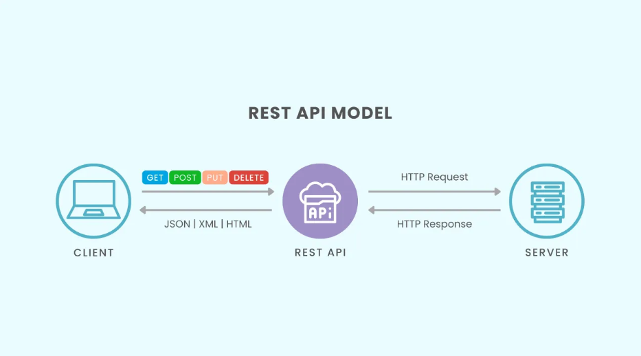

# API REST de gestion des étudiants – Flask

Ce projet présente une API REST développée en Python avec le micro-framework Flask.  
Ce document a pour objectif de servir de support pédagogique aux futures promotions (niveau M1) afin de comprendre les services web REST et leur implémentation concrète à travers un cas d’étude.

---

## 1. Services web : définition générale

Un service web est un système logiciel accessible via un réseau permettant à des applications de communiquer entre elles de manière automatisée (machine à machine).  
Il expose des fonctionnalités ou des données via une interface standardisée, généralement basée sur le protocole HTTP.

Le principe est simple :
- un client envoie une requête HTTP,
- le serveur traite cette requête,
- le serveur renvoie une réponse structurée (JSON ou XML).

Ce mécanisme est au cœur des architectures distribuées modernes.

---

## 2. Typologie des services web

### 2.1 Services web SOAP

Les services web SOAP utilisent des messages XML fortement structurés et des contrats définis par WSDL.  
Ils sont robustes mais souvent complexes à développer et à maintenir.

### 2.2 Services web REST

REST (Representational State Transfer) est un style d’architecture défini par Roy Fielding.  
Il repose sur le protocole HTTP, la notion de ressources et l’utilisation sémantique des méthodes HTTP (GET, POST, PUT, DELETE).  
Aujourd’hui, REST est le style le plus utilisé pour les API web.

---

## 3. Contexte historique de REST

Les premières architectures de services web étaient principalement basées sur SOAP.  
En 2000, Roy Fielding formalise REST dans sa thèse de doctorat, en analysant les principes qui ont permis le succès du Web.  
REST devient ensuite dominant avec l’essor des applications web et mobiles.

---

## 4. Contraintes et avantages de REST

REST repose sur plusieurs contraintes :
- séparation client–serveur,
- absence d’état côté serveur (stateless),
- ressources identifiées par des URI,
- interface uniforme.

Ces contraintes permettent une meilleure scalabilité, une maintenance facilitée et une forte interopérabilité.

---

## 5. Fonctionnement général d’une API REST

Une API REST manipule des ressources accessibles via des URI.

Dans ce projet :
- `/students` représente l’ensemble des étudiants,
- `/students/{id}` représente un étudiant précis.

Chaque requête REST contient une méthode HTTP, une URL et éventuellement des données (JSON).  
La réponse contient un code HTTP et des données structurées.




---

## 6. Mise en place de l’application Flask

```python
from flask import Flask, jsonify, request

app = Flask(__name__)
```

Ce code initialise l’application Flask.
Flask joue le rôle de serveur REST : il reçoit les requêtes HTTP et appelle les fonctions associées aux routes définies.

## 7.Définition de la ressource Étudiant

Les données sont stockées en mémoire dans une structure Python, utilisée ici à des fins pédagogiques.

```python
students = [
    {"id": 1, "name": "Youcef", "age": 21},
    {"id": 2, "name": "Mohamed", "age": 22},
    {"id": 3, "name": "Melousta", "age": 25},
    {"id": 4, "name": "Issa", "age": 23}
]

```

## Endpoint racine

```python
@app.route('/')
def home():
    return "Bienvenue dans l'API de gestion des étudiants"

```

Cet endpoint permet de vérifier que l’API est correctement lancée.


## 9. Méthode GET : lecture des ressources
La méthode GET permet de récupérer des données sans modifier l’état du serveur.
```python
@app.route('/students', methods=['GET'])
def get_etudiants():
    return jsonify(students)

```
Cette route renvoie la liste complète des étudiants au format JSON.


```python
@app.route('/students/<int:id>', methods=['GET'])
def get_student(id):
    student = next((s for s in students if s['id'] == id), None)
    if student:
        return jsonify(student)
    return jsonify({"erreur": "L'étudiant n'existe pas"}), 404

```
### Explication

Cette route est associée à la méthode HTTP GET, utilisée pour récupérer des données sans modifier l’état du serveur.
Lorsqu’un client envoie une requête GET vers /students, Flask appelle cette fonction et renvoie la liste des étudiants au format JSON.
La fonction jsonify transforme automatiquement la structure Python en une réponse JSON compréhensible par le client.
Cette route permet de récupérer un étudiant précis à partir de son identifiant.

## 10. Méthode POST : création d’une ressource
La méthode POST permet de créer une nouvelle ressource.

```python
@app.route('/students', methods=['POST'])
def add_student():
    new_student = request.get_json()
    new_student['id'] = len(students) + 1
    students.append(new_student)
    return jsonify(new_student), 201

```
### Explication

La méthode POST permet de créer une nouvelle ressource sur le serveur.
Les données envoyées par le client sont récupérées à l’aide de request.get_json().
Un identifiant est ensuite généré automatiquement, puis le nouvel étudiant est ajouté à la liste existante.
Le code HTTP 201 indique que la création de la ressource a réussi.


## 11. Méthode PUT : mise à jour d’une ressource
```python
@app.route('/students/<int:id>', methods=['PUT'])
def update_student(id):
    student = next((s for s in students if s['id'] == id), None)
    if not student:
        return jsonify({"message": "Etudiant non trouvé"}), 404
    data = request.get_json()
    student.update(data)
    return jsonify(student)

```

### Explication

La méthode PUT est utilisée pour modifier une ressource existante.
Le serveur commence par vérifier que l’étudiant correspondant à l’identifiant existe.
Les nouvelles données envoyées par le client remplacent ensuite les anciennes.
Si l’étudiant n’existe pas, une erreur HTTP 404 est retournée.


## 12. Méthode DELETE : suppression d’une ressource
```python
@app.route('/students/<int:id>', methods=['DELETE'])
def delete_student(id):
    global students
    students = [s for s in students if s['id'] != id]
    return jsonify({"message": "Etudiant supprimé"})

```

### Explication

La méthode DELETE permet de supprimer une ressource du serveur.
L’étudiant dont l’identifiant est fourni dans l’URL est retiré de la liste.
Une réponse JSON est renvoyée afin de confirmer que la suppression a bien été effectuée.

## 13. Exécution et tests

Le serveur est lancé localement et accessible à l’adresse :
http://127.0.0.1:5000

L’API peut être testée à l’aide de Postman, ce qui permet d’envoyer des requêtes HTTP, de visualiser les réponses JSON et de comprendre le fonctionnement d’une API REST.

## 14. Conclusion

Ce projet illustre les principes fondamentaux des services web REST :

communication client–serveur,

manipulation de ressources via des URI,

utilisation sémantique des méthodes HTTP,

échanges de données au format JSON.

Il constitue une base pédagogique solide pour comprendre les API REST avant d’aborder des notions plus avancées comme la persistance des données ou la sécurité.


