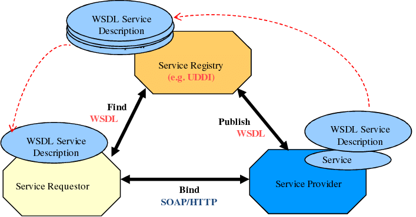

# Introduction aux services web (SOAP & REST)

## 1. Qu’est-ce qu’un service web ?

Un **service web** est un composant logiciel accessible via un réseau (le plus souvent Internet) qui permet à **des applications hétérogènes de communiquer entre elles** de manière standardisée.

L’objectif principal d’un service web est l’**interopérabilité** : une application cliente et une application serveur peuvent échanger des données **indépendamment du langage de programmation, du système d’exploitation ou de la plateforme** utilisée.

Dans une architecture classique :

* une **application cliente** envoie une requête
* un **service web** traite cette requête
* une **réponse structurée** (XML ou JSON) est retournée

Ce mécanisme est aujourd’hui au cœur des **architectures distribuées**, des **applications web**, des **API** et des **systèmes d’information complexes**.


## Fonctionnement général d’un service web

Dans un service web, la communication repose sur un échange structuré de messages entre un client et un serveur.

Le schéma général est le suivant :

* le **client** envoie une requête via le réseau
* le **service web** interprète la requête
* le **serveur** exécute la logique métier
* une **réponse** est renvoyée au client

 Dans le cas de SOAP, cette communication est entièrement basée sur **XML** et décrite par un **contrat WSDL**.


## 2. Les différents types de services web

Les services web sont apparus pour répondre à un besoin fondamental : **permettre à des applications hétérogènes de communiquer de manière standardisée via le réseau**. Deux grandes approches se sont imposées au fil du temps : **SOAP** et **REST**.


### 2.1 Service web SOAP

**SOAP (Simple Object Access Protocol)** est le **premier standard de service web** à avoir été conçu et largement adopté (fin des années 1990 – début des années 2000).

À cette époque, les systèmes informatiques étaient fortement **hétérogènes** (langages, plateformes, environnements) et avaient besoin d’un **mécanisme robuste, formel et universel** pour échanger des données.

SOAP repose sur plusieurs principes clés :

* un **protocole strict** basé exclusivement sur **XML**
* une communication fortement **structurée et contractuelle**
* une description complète du service via un **WSDL (Web Services Description Language)**

Le WSDL joue un rôle central : il définit précisément les **méthodes disponibles**, les **types de données**, les **paramètres**, ainsi que l’**adresse du service**. Ce contrat garantit une **interopérabilité maximale** et limite les ambiguïtés entre client et serveur.

Grâce à cette rigueur, SOAP s’est imposé dans les **environnements critiques** (banques, assurances, systèmes gouvernementaux), où la **fiabilité**, la **sécurité** et la **traçabilité** sont prioritaires.

Cependant, cette richesse fonctionnelle a un coût :

* complexité de mise en œuvre
* lourdeur des messages XML
* performances inférieures pour des usages simples


### 2.2 Service web REST

**REST (Representational State Transfer)** est apparu plus tard (années 2000), non pas comme un protocole, mais comme un **style d’architecture**, formalisé par Roy Fielding.

REST a été conçu **en réaction aux limites de SOAP**, notamment pour les applications web grand public qui nécessitaient :

* plus de **simplicité**
* de meilleures **performances**
* une intégration naturelle avec le protocole HTTP

Contrairement à SOAP, REST :

* exploite directement les verbes HTTP (**GET, POST, PUT, DELETE**)
* privilégie des formats légers, principalement **JSON**
* adopte une approche **stateless** (sans état côté serveur)

L’avantage majeur de REST réside dans sa **simplicité et sa flexibilité**, ce qui a favorisé son adoption massive pour :

* les API web
* les applications mobiles
* les architectures microservices

REST n’a pas vocation à remplacer SOAP dans tous les contextes. Il a été créé pour **répondre à des besoins différents**, en sacrifiant une partie de la rigueur contractuelle de SOAP au profit de la **rapidité de développement et de la légèreté**.


## 3. Fonctionnement général d’un service web SOAP

###  Principe de communication

1. Le **client** envoie une requête SOAP (XML)
2. Le **service web** traite la requête
3. Le **serveur** retourne une réponse SOAP (XML)
4. Le **registre (WSDL / JNDI)** décrit le service

 Toute la communication se fait en **XML**, quel que soit le langage du client.


## 4. Schéma de communication (description)


Ou allez dans le dossier Shema/SOAP.png


Le **WSDL** décrit :

* les méthodes disponibles
* les paramètres
* les types de données
* l’URL du service


## 5. SOAP et Java : les technologies utilisées

### 5.1 JAX-WS

Pour transformer du **Java en service web SOAP**, on utilise **JAX-WS** :

> Java API for XML Web Services

### 5.2 JAXB

JAX-WS repose sur **JAXB** (Java Architecture XML Binding).

Rôle de JAXB :

* **Sérialisation** : Java → XML
* **Désérialisation** : XML → Java


## 6. Rendre une classe Java sérialisable

Pour permettre à une classe Java d’être convertie en XML :

```java
import jakarta.xml.bind.annotation.XmlRootElement;

@XmlRootElement
public class Etudiant {
    private String nom;
    private double note;

    public Etudiant() {}

    public String getNom() {
        return nom;
    }

    public void setNom(String nom) {
        this.nom = nom;
    }

    public double getNote() {
        return note;
    }

    public void setNote(double note) {
        this.note = note;
    }
}
```

 `@XmlRootElement` permet la **sérialisation / désérialisation XML**.

---

## 8. Créer un service web SOAP en Java

### 8.1 Déclarer une classe comme service web

```java
import javax.jws.WebService;

@WebService(targetNamespace = "http://www.sorbonne.fr")
public class MonServiceWeb {

    public double somme(double a, double b) {
        return a + b;
    }
}
```

* `@WebService` : transforme la classe en service web
* `targetNamespace` : identifiant unique du service (souvent une URL)


### 8.2 Personnaliser les méthodes SOAP

```java
import javax.jws.WebMethod;
import javax.jws.WebParam;

@WebMethod(operationName = "Convertir")
public double somme(
        @WebParam(name = "parametre1") double a,
        @WebParam(name = "parametre2") double b) {
    return a + b;
}
```

* `@WebMethod` : renomme l’opération SOAP
* `@WebParam` : nomme les paramètres dans le XML


## 9. Publier le service (serveur SOAP)

```java
import javax.xml.ws.Endpoint;

public class Application {
    public static void main(String[] args) {
        String url = "http://localhost:8888/";
        Endpoint.publish(url, new MonServiceWeb());
        System.out.println("Service SOAP démarré sur " + url);
    }
}
```

 Cette étape lance le **serveur SOAP**.


## 10. Accéder au WSDL

Une fois le serveur lancé :

```
http://localhost:8888/?wsdl
```

Le WSDL contient :

* la description complète du service
* les méthodes
* les types

Remarque :  Si on ajoute une méthode, il faut **redémarrer le service**.

---

## 11. Tester le service SOAP

Outil recommandé : **SOAPUI**

Étapes :

1. Créer un nouveau projet
2. Coller l’URL du WSDL
3. Générer les requêtes
4. Envoyer une requête SOAP (XML)

Quel que soit le langage client, la **réponse sera en XML**.


## 12. Conclusion

SOAP est :

* robuste
* sécurisé
* contractuel
* adapté aux systèmes critiques

Même s’il est plus complexe que REST, il reste **fondamental pour comprendre les services web** et leur évolution.


