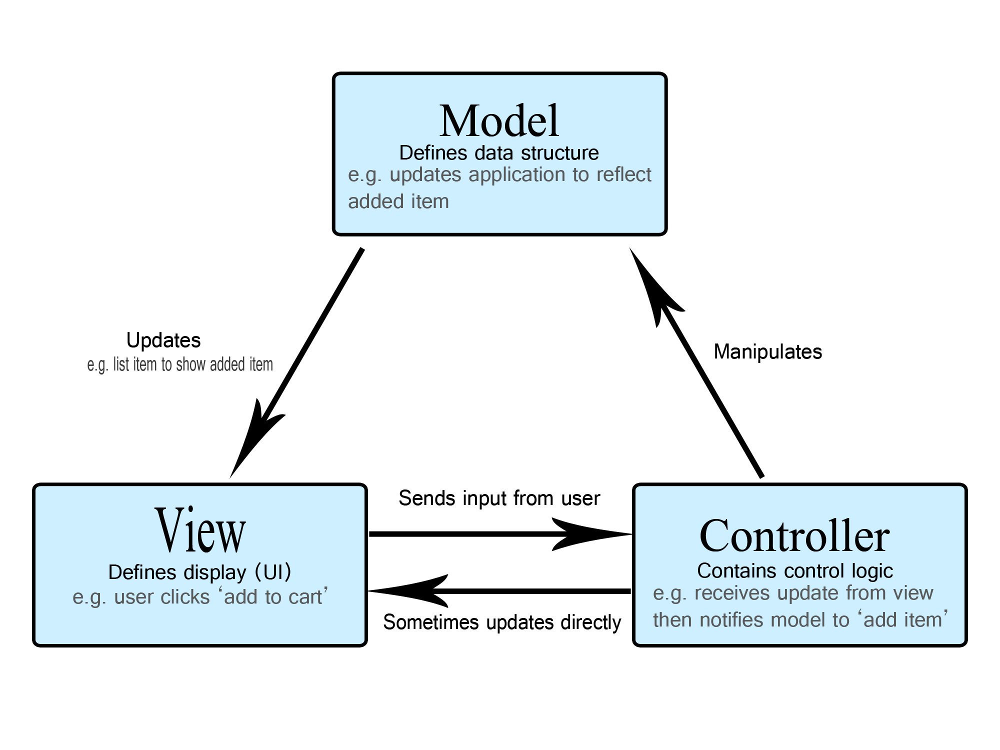

# PRINCIPE DE PROGRAMMATION  
## Étude Approfondie de l’Architecture MVC et de la Consommation d’une API REST en PHP

---

# Résumé

Ce projet s’inscrit dans le cadre du module *Principe de Programmation*.  
Il a pour objectif l’étude et la mise en œuvre d’une architecture logicielle structurée basée sur le modèle **MVC (Model – View – Controller)**, combinée à la consommation d’une **API REST** développée en Python (Flask).

À travers la réalisation d’un système CRUD de gestion d’étudiants, ce travail met en évidence les principes de séparation des responsabilités, d’interopérabilité entre systèmes, de modularité logicielle et d’organisation professionnelle du code.

---

# 1. Introduction

Le développement d’applications web modernes nécessite une structuration rigoureuse du code afin de garantir :

- Maintenabilité
- Lisibilité
- Évolutivité
- Réutilisabilité
- Travail collaboratif

Dans les premiers stades d’apprentissage, les applications sont souvent conçues de manière monolithique. Cette approche montre rapidement ses limites lorsque la complexité augmente.

Ce projet répond donc à la question suivante :

**Comment structurer une application web afin de séparer clairement les responsabilités et faciliter son évolution ?**

La réponse étudiée repose sur l’adoption du modèle architectural MVC.

---

# 2. Problématique et Justification

## 2.1 Approche non structurée

Exemple simplifié d’une application non organisée :

```php
$data = file_get_contents("http://127.0.0.1:5000/students");
$students = json_decode($data, true);

foreach ($students as $student) {
    echo $student['name'];
}
```

Problèmes identifiés :

- Mélange de logique métier et d’affichage
- Difficulté de modification
- Faible réutilisabilité
- Absence de modularité
- Complexité croissante

Une architecture formelle devient donc nécessaire.

---

# 3. Cadre Théorique

## 3.1 Architecture MVC

MVC signifie **Model – View – Controller**.

Il s’agit d’un modèle architectural qui divise une application en trois couches distinctes.

### 3.1.1 Model

Le Model encapsule :

- La logique métier
- Les données
- Les interactions avec les sources externes

Dans ce projet :

```
interop/services/StudentService.php
```

Exemple :

```php
public static function getAllStudents()
{
    return self::request('GET', '/students');
}
```

Le modèle est responsable de la communication avec l’API.

---

### 3.1.2 View

La View gère exclusivement l’affichage.

Exemple :

```php
<?php foreach ($students as $student): ?>
    <p><?= $student['name'] ?> (<?= $student['age'] ?> ans)</p>
<?php endforeach; ?>
```

Elle ne contient aucune logique métier.

---

### 3.1.3 Controller

Le Controller coordonne l’application.

```php
public static function index()
{
    $students = StudentService::getAllStudents();
    require __DIR__ . '/../views/students.php';
}
```

Il :

- Reçoit la requête
- Interroge le modèle
- Transmet les données à la vue

---

# 4. Diagramme Conceptuel MVC



Flux logique :

1. Requête utilisateur
2. Front Controller
3. Controller
4. Model
5. View
6. Réponse HTTP

---

# 5. API REST

## 5.1 Définition

Une API (Application Programming Interface) permet à deux systèmes de communiquer.

REST (Representational State Transfer) repose sur :

- Le protocole HTTP
- Une architecture orientée ressources
- L’utilisation du format JSON

---

## 5.2 Méthodes HTTP

| Méthode | Rôle |
|----------|------|
| GET | Lecture |
| POST | Création |
| PUT | Mise à jour |
| DELETE | Suppression |

---

## 5.3 Format JSON

Exemple :

```json
{
  "id": 1,
  "name": "Ali",
  "age": 21
}
```

Conversion en PHP :

```php
$students = json_decode($response, true);
```

---

# 6. Méthodologie d’Implémentation

## 6.1 Front Controller

```php
$action = $_GET['action'] ?? 'list';

switch ($action) {
    case 'create':
        StudentController::create();
        break;
}
```

Centralisation des requêtes.

---

## 6.2 Communication HTTP

```php
$options = [
    'http' => [
        'method' => 'GET',
        'header' => "Content-Type: application/json\r\n"
    ]
];

$context = stream_context_create($options);
$response = file_get_contents($url, false, $context);
return json_decode($response, true);
```

Étapes :

1. Configuration
2. Envoi
3. Réception
4. Décodage

---

# 7. Cycle d’Exécution d’une Requête

Exemple : ajout d’un étudiant.

1. Soumission du formulaire.
2. Appel de :

```
index.php?action=create
```

3. Appel du contrôleur.
4. Transmission des données au service.
5. Envoi d’une requête POST.
6. Réception d’une réponse JSON.
7. Redirection vers la liste.
8. Affichage mis à jour.

---

# 8. Analyse Critique

## Avantages

- Séparation claire des responsabilités
- Architecture modulaire
- Code maintenable
- Facilité d’évolution
- Interopérabilité technologique

## Limites

- Complexité initiale plus élevée
- Nécessite rigueur organisationnelle

---

# 9. Comparaison Architecturale

| Approche Monolithique | Architecture MVC |
|-----------------------|------------------|
| Code mélangé | Code structuré |
| Maintenance difficile | Maintenance facilitée |
| Peu évolutif | Évolutif |
| Peu lisible | Lisible |

---

# 10. Perspectives d’Évolution

- Validation avancée
- Gestion d’exceptions
- Sécurisation des entrées
- Authentification
- Migration vers un framework (Laravel, Symfony)

---

# Conclusion Générale

Ce projet illustre l’application concrète des principes fondamentaux du développement structuré.

Il démontre que :

- L’architecture influence directement la qualité logicielle.
- La séparation des responsabilités est essentielle.
- REST permet l’interopérabilité entre technologies.
- MVC constitue une base solide pour des applications évolutives.

Ce travail constitue une étape fondamentale vers la maîtrise des architectures logicielles modernes et prépare efficacement à l’utilisation de frameworks professionnels.
